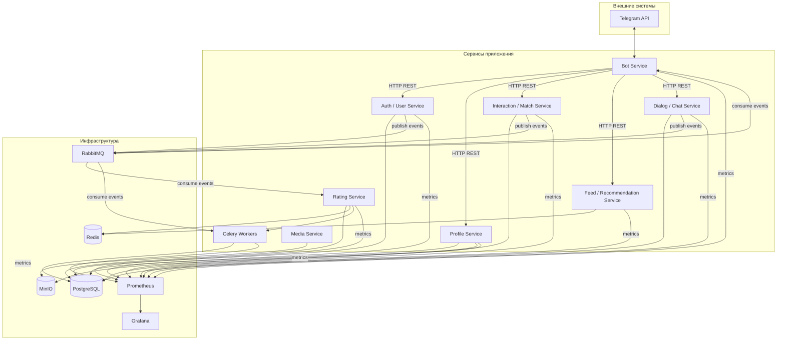

## Диаграмма компонентов (Component Diagram)

Высокоуровневое представление сервисов, инфраструктуры и связей между ними.

## Легенда

| Тип связи | Описание |
|----------|----------|
| HTTP REST | Синхронные запросы (регистрация, анкеты, свайпы, лента, диалоги) |
| MQ events | Асинхронные события (`profile.liked`, `profile.skipped`, `match.created`, `dialog.started`, `message.sent`) |
| metrics | Экспорт метрик для Prometheus |

