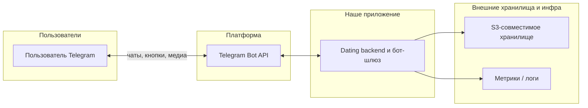

# Контекст системы

Ниже — упрощённая **контекстная** картина: что считается «чёрным ящиком» для пользователя и какие внешние системы подключены. Это не дублирует детальную [диаграмму компонентов](component-diagram.md), а задаёт рамку «кто с кем говорит».

**Смысл блоков**

- **Dating backend и бот-шлюз** — логика анкет, ленты, мэтчей, рейтингов; с точки зрения диаграммы это совокупность сервисов из `ARCHITECTURE.md`, а не один монолит.
- **S3 / Minio** — только файлы; метаданные и связи живут в основной БД.
- **Метрики / логи** — наблюдаемость без привязки к конкретному стеку (Prometheus, Grafana и т.д. — как в компонентной схеме).

Такой срез удобно показывать отдельно от «внутренней кухни» микросервисов.
