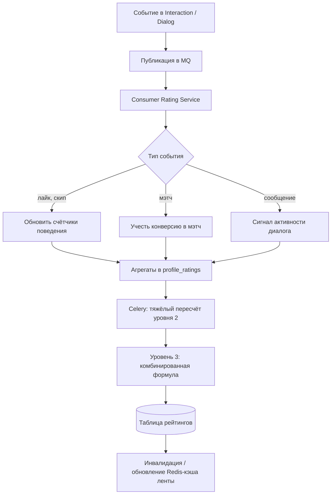

# Пайплайн событий и рейтинга

Обобщённый поток: **действие пользователя → событие → агрегация → уровни рейтинга → обновление выдачи**. Это дополняет текстовый раздел про Celery и MQ в `ARCHITECTURE.md`.

**Уровни (напоминание)**

1. **Первичный** — в основном из данных анкеты и полноты; обновляется при существенных правках профиля.
2. **Поведенческий** — из стриминга событий и агрегатов.
3. **Комбинированный** — периодически сводит 1 и 2 (и, при необходимости, реферальный бонус).

На диаграмме не показаны отдельные топики Kafka vs очереди RabbitMQ — достаточно договориться об именах событий и идемпотентности обработчиков.
