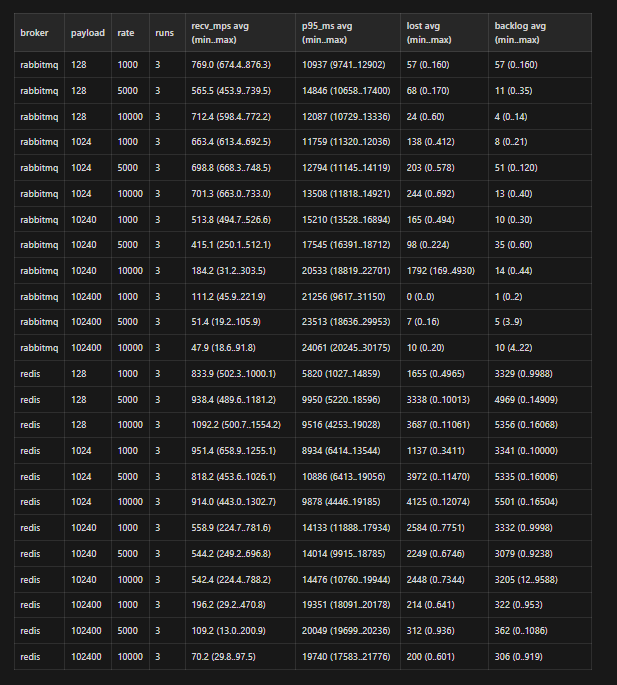

## Сравнение RabbitMQ и Redis (практика 2)

### Запуск (Windows / Linux)

Поднять брокеры (см. `docker-compose.yml`: Redis `7.2-alpine`, Rabbit `3-management`):

```bash
docker compose -f docker-compose.yml up -d
```

```bash
pip install -r requirements.txt
```

**Полный прогон (все 3 эксперимента, как `run-tests.sh` + `npx ts-node src/benchmark.ts all`):**

```bash
python run_benchmark.py all
```

Или PowerShell, как аналог `run-tests.sh`:

```powershell
.\run-tests.ps1 all
```

Только одна серия: `python run_benchmark.py basic` (или `size`, `rate`).

Результаты в `results/`:

- `results.csv`, `report.md` — итог последнего прогона;
- `results-<timestamp>.json` (при `all` — `results-….json` с полной сводкой) — выгрузка в JSON, как в референсе.

**Старая «матрица 4×3»** (если вдруг нужна для сравнения): `python run_benchmark.py legacy-suite` (и опционально `--runs N`).

Один сценарий вручную:

```bash
python run_benchmark.py run --broker rabbitmq --payload-bytes 1024 --rate 1000 --duration-sec 15 --label "test"
# rate=0  →  режим MAX (как в benchmark.ts, до cap в 500 сообщений/батч)
```

### Скриншоты (`screens/`)

`docker ps` — контейнеры `broker-rabbitmq` и `broker-redis`:


Прогон `python run_benchmark.py all` (фрагмент: Experiment 1, basic 1 KB @1k/s):


Сводная таблица по повторам (legacy-матрица, `legacy-suite` + `summarize_repeats`):



---

### Состав экспериментов (1:1 с `src/benchmark.ts`)


| Команда | Содержание                                                                                          |
| ------- | --------------------------------------------------------------------------------------------------- |
| `basic` | 1 KB, **1000 msg/s**, **20 s** — по одному прогону на брокер                                        |
| `size`  | размеры **128 B, 1 KB, 10 KB, 100 KB** при **1000/s**, **15 s** (на каждый размер — Rabbit и Redis) |
| `rate`  | **1 KB**, скорости **1k, 5k, 10k, 20k, MAX(0)**, **15 s** — по два прогона (брокер × сценарий)      |


Пауза **~2.5 s** между сценариями, после каждой серии **~2 s**. **Grace** после остановки producer: `min(5 s, duration × 0.3)` — фиксированное окно, не «дождаться нуля в очереди».

---

### Описание стенда

- **Producer**: пакетная отправка в **окна 50 ms**; целевой RPS — через число сообщений в окно (20 окон/с), как в TypeScript-реализации.
- **RabbitMQ**: не durable queue **`benchmark`**, `prefetch=200`, `ack` после `JSON.parse`.
- **Redis**: stream **`benchmark-stream`**, group **`benchmark-group`**, consumer **`consumer-1`**, `XADD` + `XREADGROUP` + `XACK` (см. референс; это не `RPUSH`/`LPOP`).

### Метрики

- `recv_msg_per_sec` / `sent_msg_per_sec`: **фактические** величины, нормированные на **длительность фазы producer** (как `actualRatePerSec` в `utils.ts` референса), не на «только объявленные в задании 10/15/20 s».
- `lost = max(0, sent - received)`.
- `backlog` для Rabbit — глубина очереди **после grace**; для Redis **не** заполняется (в stream сообщения остаются в логе; для честного сравнения смотрите `lost` и latency).
- p95: как в `utils.ts` (индекс от `Math.ceil`).

### Сводка по повторам (опционально)

Несколько прогонов: `python run_benchmark.py legacy-suite --runs 3 --out-dir results_repeats`, затем `python summarize_repeats.py --root results_repeats --out results/summary.md`.

Актуальные цифры: `results/report.md`, `results/results.csv`, `results/results-*.json` (после `python run_benchmark.py all`).

---

### Итоговые выводы (по последнему прогону `results/`)

Абсолютные `act/s` **сильно зависят от ПК и Docker**; на стенде автора (Windows, Python `asyncio`) писатель не выжимал целевой 1k msg/s по wall-clock, зато **во всех 20 сценариях `lost = 0`** — сравнение брокеров остаётся корректным в рамках одного запуска.

- **Пропускная способность (факт. `recv_msg_per_sec`)**: на малых сообщениях **Redis (Streams)** заметно выше (например, basic 1 KB: Redis ~~665/s vs Rabbit ~92/s в таблице). На **100 KB** оба упираются в пропускную способность (~~25–35 act/s в этом прогоне), **Redis** при этом сильно проигрывает по **задержке** (см. `p95` и `max` в `size` для 100 KB).
- **Размер сообщения (`size`)**: рост payload с 128 B до 100 KB снижает `act/s` у обоих; у **Redis** на 10–100 KB растут **avg/p95 latency** сильнее, чем у **RabbitMQ** в этом наборе измерений.
- **Интенсивность (`rate`, 1 KB)**: при росте целевого RPS **Redis** сохраняет существенно более высокий `act/s` (до ~1.3k при MAX); **RabbitMQ** на отдельном инстансе остаётся в вилке ~90–180 act/s — узкое место здесь сочетание клиента и брокера, а не «потеря» сообщений (`lost=0`). **Backlog** у Rabbit после grace в прогоне был **0**.
- **Инструмент**: Python-раннер повторяет логику референса (батчи 50 ms, Streams, те же метрики); для отчёта приложены `results/` и JSON.

