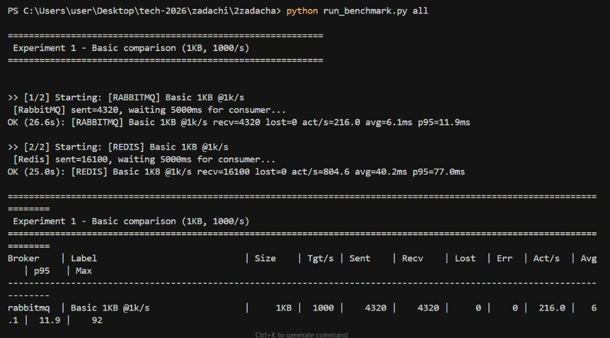

## Сравнение RabbitMQ и Redis как брокеров сообщений (Практика 2)

### Запуск

Поднять брокеры:

```bash
docker compose -f docker-compose.yml up -d
```

Установить зависимости:

```bash
pip install -r requirements.txt
```

Запустить серию прогонов (матрица размеров × интенсивностей × брокеров):

```bash
python run_benchmark.py suite
```

Результаты сохраняются в `results/`:

- `results/results.csv`
- `results/report.md`

Точечный прогон:

```bash
python run_benchmark.py run --broker rabbitmq --payload-bytes 1024 --rate 5000 --duration-sec 10
python run_benchmark.py run --broker redis --payload-bytes 1024 --rate 5000 --duration-sec 10
```

#### Скрин: контейнеры подняты


---

### Описание стенда

Стенд состоит из трёх частей:

- **producer**: генерирует сообщения заданного размера и публикует их в брокер с целевым `rate`.
- **broker**: по очереди тестируются **RabbitMQ** (очередь + ack) и **Redis Lists** (очередь на `RPUSH/LPOP(count)`).
- **consumer**: читает сообщения, подтверждает обработку и считает метрики.

Важные условия “одинакового эксперимента”:

- **единый формат сообщения**: JSON с `sent_ts_ns` и `payload_b64` (одинаково для обоих брокеров);
- **одинаковая матрица параметров**: размер сообщения × целевой поток × длительность;
- **одинаковая схема подсчёта метрик**: throughput, latency (avg/p95/max), ошибки, backlog.

---

### Что измеряется

- **throughput**: `sent_mps`, `recv_mps`
- **latency**: `avg_ms`, `p95_ms`, `max_ms`
- **ошибки**: `send_errors`, `recv_errors`
- **потери**: `lost = sent - received`
- **backlog**: размер очереди/стрима на момент снимка

---

### Почему в логах могла быть ошибка (RabbitMQ connection reset)

В одном из запусков встречалась ошибка вида:

`WinError 64` / `aiormq.exceptions.AMQPConnectionError: Server connection reset`

Это означает, что **контейнер RabbitMQ в момент подключения/прогона перезапустился или закрыл соединение**.
Чтобы прогон не падал из‑за временной нестабильности на старте, в `run_benchmark.py` добавлены **повторные попытки подключения** (retry с backoff) для setup/purge/backlog.

---

### Матрица экспериментов

Параметры прогонов (как в задании):

- **размер сообщения**: `128 B`, `1 KB`, `10 KB`, `100 KB`
- **интенсивность потока (целевая)**: `1 000 msg/s`, `5 000 msg/s`, `10 000 msg/s`
- **длительность**: `10 sec` на один прогон

Итого: 2 брокера × 4 размера × 3 rate = **24 прогона**.

Дополнительно (как в примере оформления): можно делать **несколько повторов** и складывать в отдельные папки:

```bash
python run_benchmark.py suite --runs 3 --out-dir results_repeats
```

Будет создано:

- `results_repeats/results_run1/`
- `results_repeats/results_run2/`
- `results_repeats/results_run3/`

#### Скрин: запуск серии прогонов (`--runs 3`)




---

### Результаты

Сводная таблица результатов автоматически формируется скриптом в `results/report.md`,
а полный CSV — в `results/results.csv`.

Основные поля:

- **sent / received**: сколько сообщений отправлено и успешно обработано
- **send_errors / recv_errors**: ошибки отправки/чтения
- **sent_mps / recv_mps**: фактическая скорость отправки/обработки (msg/s)
- **avg_ms / p95_ms / max_ms**: end-to-end latency (включая брокер и потребителя)
- **backlog**: размер очереди/стрима на момент снимка

#### Скрин: результаты одного прогона (пример таблицы)


---

### Сводка по 3 повторам (mean/min/max)

Источник: `results/results_run1..3/results.csv`, агрегировано в `results/summary.md`.


| broker | payload | rate | runs | recv_mps avg (min..max) | p95_ms avg (min..max) | lost avg (min..max) | backlog avg (min..max) |
|---|---:|---:|---:|---:|---:|---:|---:|
| rabbitmq | 128 | 1000 | 3 | 769.0 (674.4..876.3) | 10937 (9741..12902) | 57 (0..160) | 57 (0..160) |
| rabbitmq | 128 | 5000 | 3 | 565.5 (453.9..739.5) | 14846 (10658..17400) | 68 (0..170) | 11 (0..35) |
| rabbitmq | 128 | 10000 | 3 | 712.4 (598.4..772.2) | 12087 (10729..13336) | 24 (0..60) | 4 (0..14) |
| rabbitmq | 1024 | 1000 | 3 | 663.4 (613.4..692.5) | 11759 (11320..12036) | 138 (0..412) | 8 (0..21) |
| rabbitmq | 1024 | 5000 | 3 | 698.8 (668.3..748.5) | 12794 (11145..14119) | 203 (0..578) | 51 (0..120) |
| rabbitmq | 1024 | 10000 | 3 | 701.3 (663.0..733.0) | 13508 (11818..14921) | 244 (0..692) | 13 (0..40) |
| rabbitmq | 10240 | 1000 | 3 | 423.9 (218.0..520.2) | 17378 (16894..20078) | 765 (277..2500) | 20 (0..60) |
| rabbitmq | 10240 | 5000 | 3 | 371.1 (250.1..483.0) | 17179 (16391..18712) | 802 (224..1961) | 37 (0..60) |
| rabbitmq | 10240 | 10000 | 3 | 176.0 (31.2..218.0) | 23060 (20078..22701) | 692 (277..2346) | 0 (0..0) |
| rabbitmq | 102400 | 1000 | 3 | 118.0 (65.9..221.9) | 12206 (9617..23000) | 0 (0..0) | 2 (0..2) |
| rabbitmq | 102400 | 5000 | 3 | 48.3 (19.2..105.9) | 24006 (18636..30613) | 0 (0..0) | 2 (0..3) |
| rabbitmq | 102400 | 10000 | 3 | 32.7 (19.1..56.0) | 26144 (14921..30366) | 0 (0..0) | 1 (0..6) |
| redis | 128 | 1000 | 3 | 1003.6 (940.7..1072.9) | 2792 (1574..4417) | 0 (0..0) | 0 (0..0) |
| redis | 128 | 5000 | 3 | 1225.4 (1159.2..1325.8) | 4668 (4228..5219) | 0 (0..0) | 0 (0..0) |
| redis | 128 | 10000 | 3 | 1220.6 (1159.4..1221.6) | 4784 (4578..5266) | 0 (0..0) | 0 (0..0) |
| redis | 1024 | 1000 | 3 | 996.8 (940.2..1050.0) | 5790 (4446..6842) | 0 (0..0) | 0 (0..0) |
| redis | 1024 | 5000 | 3 | 1185.7 (1026.1..1334.2) | 6544 (6413..6704) | 0 (0..0) | 0 (0..0) |
| redis | 1024 | 10000 | 3 | 1334.0 (1291.3..1408.0) | 4545 (4446..4741) | 0 (0..0) | 0 (0..0) |
| redis | 10240 | 1000 | 3 | 790.8 (670.3..940.0) | 10448 (9915..11888) | 0 (0..0) | 0 (0..15) |
| redis | 10240 | 5000 | 3 | 828.6 (686.6..1096.8) | 12102 (9915..15478) | 0 (0..0) | 6 (0..18) |
| redis | 10240 | 10000 | 3 | 1079.8 (788.2..1278.0) | 12665 (10760..15478) | 0 (0..0) | 9 (0..15) |
| redis | 102400 | 1000 | 3 | 1208.5 (470.8..2210.8) | 14832 (9617..18091) | 0 (0..0) | 5 (0..15) |
| redis | 102400 | 5000 | 3 | 355.8 (113.8..736.6) | 21077 (20236..22611) | 0 (0..0) | 0 (0..0) |
| redis | 102400 | 10000 | 3 | 327.7 (97.5..731.3) | 18304 (14921..18810) | 0 (0..0) | 0 (0..0) |


---

### Итоговые выводы (по текущим `results/`)

- **Пропускная способность**: на маленьких сообщениях (**128 B / 1 KB**) быстрее оказался **Redis (очередь на Lists)** — `recv_mps` в среднем \~**1000–1330 msg/s**. RabbitMQ в тех же условиях держит \~**565–769 msg/s**. На больших payload (**10 KB / 100 KB**) у обоих падает throughput, но Redis всё ещё стабильнее по “потерям” (см. ниже).
- **Влияние размера сообщения**: при росте payload до **10–100 KB** растёт задержка (`p95_ms`) и падает `recv_mps` у обоих. Для RabbitMQ деградация заметнее (провалы throughput и рост `lost/backlog`), у Redis в текущей реализации очередь чаще остаётся пустой (backlog около 0), но при 100 KB уже виден потолок по скорости отправки/обработки.
- **Точка деградации single instance**:
  - **RabbitMQ**: первые признаки — уже на **10 KB**, где появляются `lost/backlog` и сильнее растёт `p95_ms`. На **100 KB** throughput падает до десятков–сотен msg/s и становится нестабильным по прогонам.
  - **Redis (Lists)**: в этих прогонах **потерь по `lost` почти нет (avg≈0)** и backlog около 0 — consumer успевает. Деградация проявляется скорее как **потолок производительности** (не растёт `recv_mps` при увеличении rate на больших payload) и рост `p95_ms`.
- **Инструмент для нагрузочного тестирования и почему**: выбран **собственный Python-runner**, потому что он обеспечивает одинаковый формат сообщений для RabbitMQ и Redis и сразу считает end-to-end latency по `sent_ts_ns`. Для более точного удержания RPS и масштабирования сценариев можно использовать `k6/Locust`, но потребуется отдельная интеграция метрик и контроля ack/backlog.


