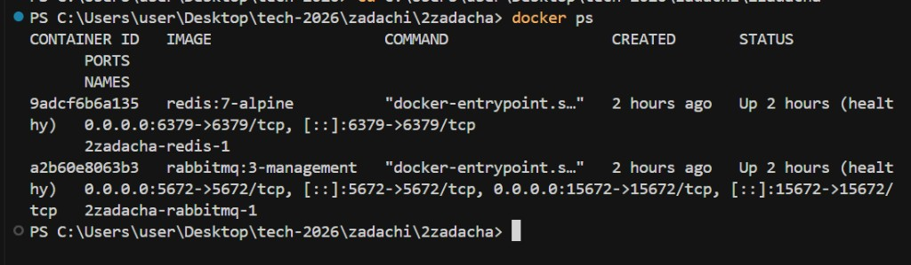
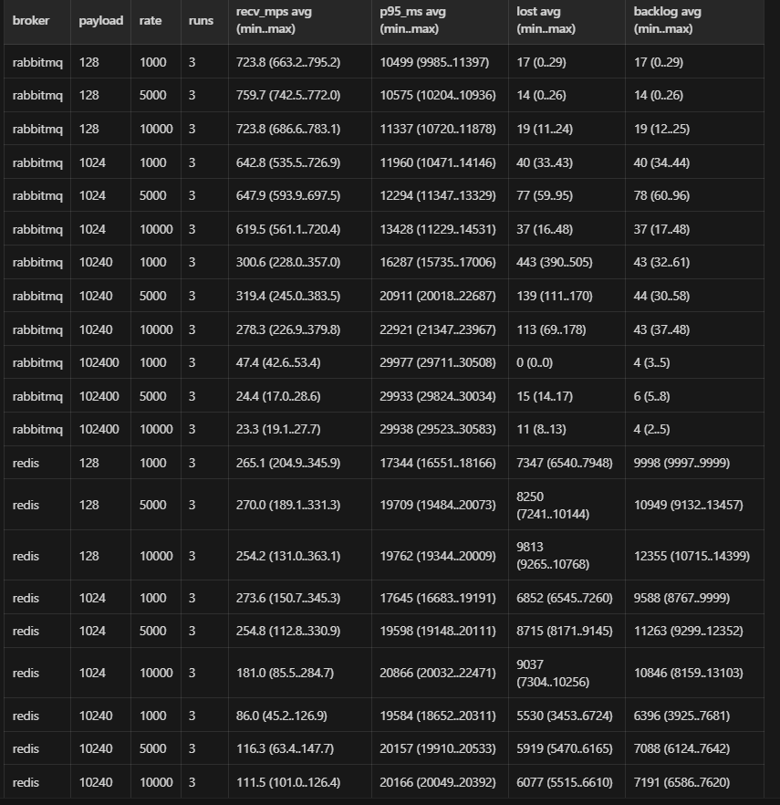
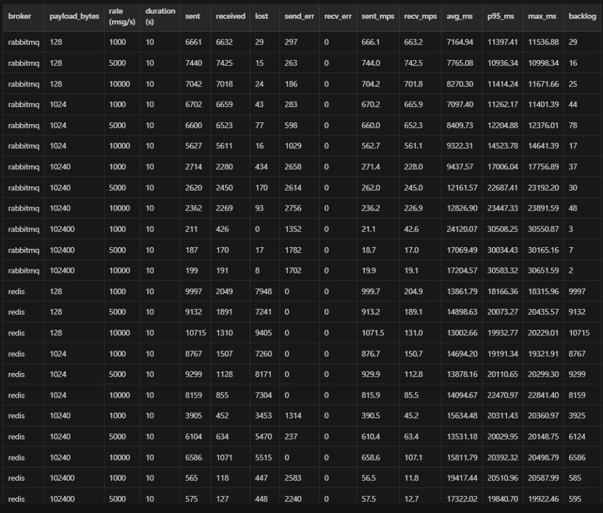

## Сравнение RabbitMQ и Redis (практика 2)

Методика и **набор прогонов** приведены к варианту из репозитория-референса: [tasks/22.04-broker (SGulsim/tech-2026)](https://github.com/SGulsim/tech-2026/tree/main/tasks/22.04-broker) — те же **три эксперимента** (`basic` / `size` / `rate`), **батчи по 50 ms**, **Redis — Streams** (`XADD` + `XREADGROUP` + `XACK`, batch read `COUNT=200` `BLOCK=100` как в `redis-bench.ts`), **RabbitMQ** — classic queue `benchmark` + `prefetch(200)` + `ack` как в `rabbitmq.ts`. Формат сообщения: JSON `{"id","sentAt" (ms), "payload"}`.

### Запуск (Windows / Linux)

Поднять брокеры (образы и лимиты как в `docker-compose.yml` референса: Redis `7.2-alpine` + `maxmemory 512mb` `noeviction`, Rabbit `3.12-management`):

```bash
docker compose -f docker-compose.yml up -d
```

```bash
pip install -r requirements.txt
```

**Полный прогон (все 3 эксперимента, как `run-tests.sh` + `npx ts-node src/benchmark.ts all`):**

```bash
python run_benchmark.py all
```

Или PowerShell, как аналог `run-tests.sh`:

```powershell
.\run-tests.ps1 all
```

Только одна серия: `python run_benchmark.py basic` (или `size`, `rate`).

Результаты в `results/`:

- `results.csv`, `report.md` — итог последнего прогона;
- `results-<timestamp>.json` (при `all` — `results-….json` с полной сводкой) — выгрузка в JSON, как в референсе.

**Старая «матрица 4×3»** (если вдруг нужна для сравнения): `python run_benchmark.py legacy-suite` (и опционально `--runs N`).

Один сценарий вручную:

```bash
python run_benchmark.py run --broker rabbitmq --payload-bytes 1024 --rate 1000 --duration-sec 15 --label "test"
# rate=0  →  режим MAX (как в benchmark.ts, до cap в 500 сообщений/батч)
```

#### Скрин: контейнеры



---

### Состав экспериментов (1:1 с `src/benchmark.ts`)

| Команда | Содержание |
|--------|------------|
| `basic` | 1 KB, **1000 msg/s**, **20 s** — по одному прогону на брокер |
| `size` | размеры **128 B, 1 KB, 10 KB, 100 KB** при **1000/s**, **15 s** (на каждый размер — Rabbit и Redis) |
| `rate` | **1 KB**, скорости **1k, 5k, 10k, 20k, MAX(0)**, **15 s** — по два прогона (брокер × сценарий) |

Пауза **~1.5 s** между сценариями, после каждой серии **~2 s** (как в оригинале). **Grace** после остановки producer: `min(5 s, duration × 0.3)` — фиксированное окно, не «дождаться нуля в очереди».

---

### Описание стенда

- **Producer**: пакетная отправка в **окна 50 ms**; целевой RPS — через число сообщений в окно (20 окон/с), как в TypeScript-реализации.
- **RabbitMQ**: не durable queue **`benchmark`**, `prefetch=200`, `ack` после `JSON.parse`.
- **Redis**: stream **`benchmark-stream`**, group **`benchmark-group`**, consumer **`consumer-1`**, `XADD` + `XREADGROUP` + `XACK` (см. референс; это не `RPUSH`/`LPOP`).

### Метрики

- `recv_msg_per_sec` / `sent_msg_per_sec`: **фактические** величины, нормированные на **длительность фазы producer** (как `actualRatePerSec` в `utils.ts` референса), не на «только объявленные в задании 10/15/20 s».
- `lost = max(0, sent - received)`.
- `backlog` для Rabbit — глубина очереди **после grace**; для Redis **не** заполняется (в stream сообщения остаются в логе; для честного сравнения смотрите `lost` и latency).
- p95: как в `utils.ts` (индекс от `Math.ceil`).

#### Скрин: пример вывода



---

### Сводка по повторам (опционально)

Несколько прогонов: `python run_benchmark.py legacy-suite --runs 3 --out-dir results_repeats`, затем `python summarize_repeats.py --root results_repeats --out results/summary.md`.

(Таблицы в этом README со **старыми** цифрами после смены методики не актуальны — **обновите вывод** после `python run_benchmark.py all` и при необходимости вставьте краткую сводку сюда.)

---

### Итоговые выводы (заполнить по свежим `results/`)

- **Пропускная способность**: сравните `recv_msg_per_sec` в экспериментах `size` / `rate`, учитывая, что `MAX` (rate=0) даёт **насыщение** писателя, а не «целевой 0 RPS».
- **Влияние размера сообщения**: `size` — фиксированный 1000/s.
- **Деградация на одном инстансе**: `rate` — рост `lost` и latency при 20k/s и `MAX` на 1 KB; для Rabbit смотрите `backlog` после grace.
- **Почему Python**: тот же смысл, что и `ts-node` + `ioredis`/`amqplib` — **один и тот же** набор сценариев и формул, без требования Node.js, но **результаты** необходимо переснять локально (они зависят от машины и Docker).

#### Скрин: итог


