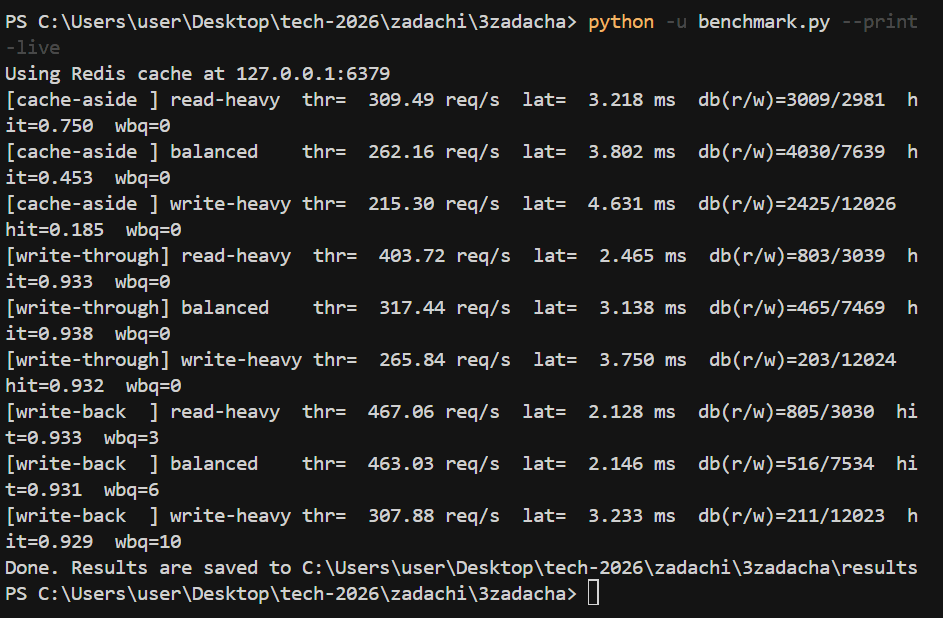

# Отчет: сравнение типов кеширования

## Условия теста

- Набор ключей: `1000`
- Длительность каждого профиля: `10.0` сек (фиксированная)
- Профили: read-heavy 80/20, balanced 50/50, write-heavy 20/80
- Измерения: throughput, средняя задержка, обращения в БД, cache hit rate

## Результаты

| Strategy | Profile | Throughput req/s | Avg latency ms | DB reads | DB writes | Cache hit rate | WB queue max |
| --- | --- | ---: | ---: | ---: | ---: | ---: | ---: |
| cache-aside | read-heavy | 155.48 | 6.415 | 762 | 334 | 0.376 | 0 |
| cache-aside | balanced | 207.73 | 4.798 | 743 | 1035 | 0.288 | 0 |
| cache-aside | write-heavy | 206.93 | 4.816 | 337 | 1688 | 0.118 | 0 |
| write-through | read-heavy | 191.38 | 5.208 | 658 | 382 | 0.570 | 0 |
| write-through | balanced | 248.10 | 4.015 | 475 | 1225 | 0.622 | 0 |
| write-through | write-heavy | 212.10 | 4.699 | 160 | 1746 | 0.574 | 0 |
| write-back | read-heavy | 301.78 | 3.297 | 739 | 680 | 0.685 | 2 |
| write-back | balanced | 287.67 | 3.459 | 488 | 1431 | 0.663 | 2 |
| write-back | write-heavy | 294.43 | 3.376 | 184 | 2364 | 0.685 | 5 |

## Краткие выводы

- `read-heavy`: лучший throughput у `write-back` (301.78 req/s), avg latency 3.297 ms, hit rate 0.685.
- `balanced`: лучший throughput у `write-back` (287.67 req/s), avg latency 3.459 ms, hit rate 0.663.
- `write-heavy`: лучший throughput у `write-back` (294.43 req/s), avg latency 3.376 ms, hit rate 0.685.
- `write-back`: максимальная накопленная flush-очередь = `5`.

## Логи

- Лог последнего прогона на Redis: `results/console.log`.

## Скриншоты консоли

Прогон единого теста с Redis:

